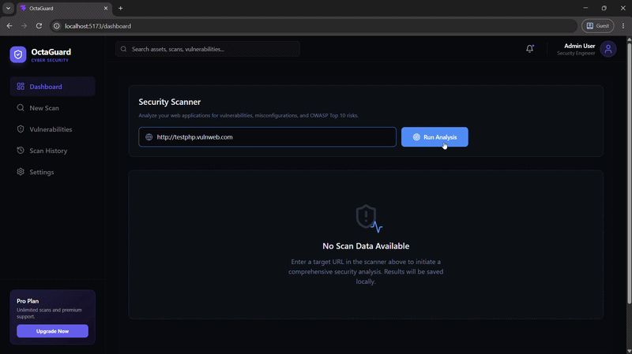
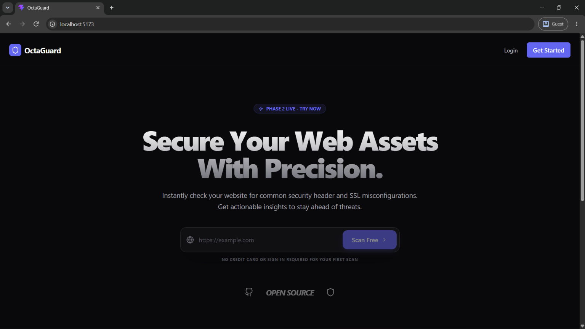
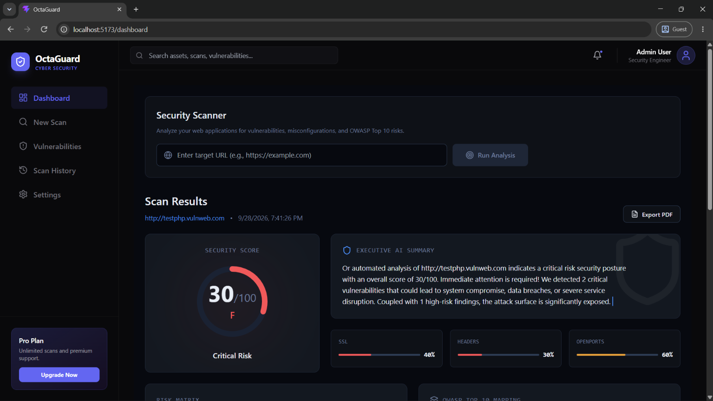
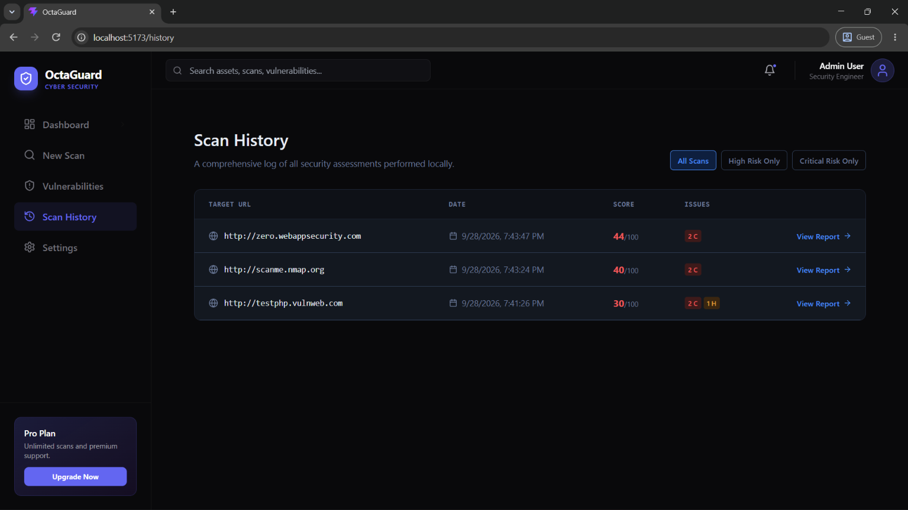
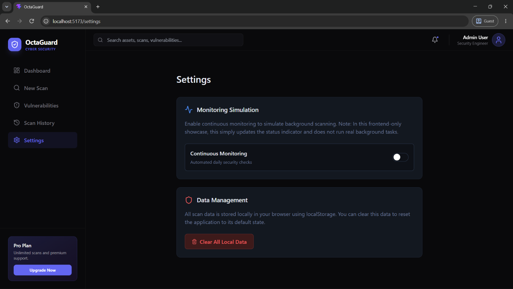

<div align="center">
  <h1>🛡️ OctaGuard</h1>
  <p><strong>A Modern Cybersecurity SaaS Platform for Website Vulnerability Scanning</strong></p>
  
  [](#)
  [](#)
  [](#)
  [](#)
  [](#)
  [](#)
</div>

<hr/>

OctaGuard is an open-source cybersecurity SaaS platform foundation designed to perform basic, lightweight vulnerability scanning on web applications. It provides a sleek, modern, and highly responsive dashboard to present actionable security insights. 

**Note**: This project serves as a foundational shell and UI showcase. The current scanning engine performs basic checks (e.g., missing security headers, missing HTTPS, basic tech stack detection). It is **not** integrated with any real-time, advanced vulnerability engines.

---

## ✨ Key Features

- 🔐 **Authentication**: Secure Login and Registration flows.
- 📊 **Interactive Dashboard**: Real-time data visualization using Recharts.
- 🛡️ **Vulnerability Scanning**: Initiate scans and view vulnerability reports based on lightweight header and configuration checks.
- 📜 **Scan History**: Keep track of previous scans, complete with severity categorization and resolution status.
- 📄 **Export Reports**: Generate and download scan reports in PDF format.
- 🎨 **Modern Aesthetics**: A beautifully crafted dark-themed UI built with TailwindCSS, Lucide React icons, and Sonner notifications.

---

## 📸 Screenshots

### Demo Video


### Home Page


### Dashboard Overview


### Scan History


### Settings


---

## 🏗️ Architecture & Tech Stack

OctaGuard is built utilizing a decoupled Client-Server architecture.

### Frontend
- **Framework**: [React.js](https://reactjs.org/) (v19)
- **Bundler**: [Vite](https://vitejs.dev/)
- **Styling**: [Tailwind CSS](https://tailwindcss.com/)
- **Routing**: [React Router](https://reactrouter.com/) (v7)
- **Charts**: [Recharts](https://recharts.org/)
- **Icons**: [Lucide React](https://lucide.dev/)
- **Notifications**: [Sonner](https://sonner.emilkowal.ski/)
- **PDF Generation**: `jspdf` & `html2canvas`

### Backend
- **Runtime**: [Node.js](https://nodejs.org/)
- **Framework**: [Express.js](https://expressjs.com/)
- **ORM**: [Prisma](https://www.prisma.io/) (v6)
- **Database**: SQLite (Development)
- **Security**: CORS, Environment variable management (Dotenv)

---

## 🚀 Getting Started

Follow these steps to set up OctaGuard locally on your machine.

### Prerequisites

Ensure you have the following installed:
- **Node.js** (v18.x or higher)
- **npm** or **yarn**
- Git

### 1. Clone the Repository

```bash
git clone https://github.com/yourusername/OctaGuard.git
cd OctaGuard
```

### 2. Backend Setup

Open a terminal and navigate to the backend directory:

```bash
cd backend
npm install
```

**Environment Variables:**
Create a `.env` file in the `backend` directory:
```env
PORT=5000
DATABASE_URL="file:./dev.db"
JWT_SECRET="your_super_secret_jwt_string_here"
```

**Database Initialization:**
```bash
# Initialize Prisma and create the database
npx prisma migrate dev --name init
npx prisma generate

# Start the development server
npm run dev
```
*The backend server will run on `http://localhost:5000`.*

### 3. Frontend Setup

Open a new terminal window and navigate to the frontend directory:

```bash
cd frontend
npm install
```

**Environment Variables:**
Create a `.env` file in the `frontend` directory:
```env
VITE_API_URL="http://localhost:5000/api"
```

**Start the Application:**
```bash
# Start the Vite development server
npm run dev
```
*The frontend application will be accessible at `http://localhost:5173`.*

---

## 📂 Project Structure

```text
OctaGuard/
├── backend/                  # Node.js + Express Backend
│   ├── prisma/               # Database schema and migrations
│   ├── src/
│   │   ├── controllers/      # Route handlers (Logic)
│   │   ├── routes/           # API routes definition
│   │   ├── services/         # Business logic & external API calls
│   │   └── server.js         # Express App Entry Point
│   ├── .env                  # Backend configuration
│   └── package.json
│
├── frontend/                 # React + Vite Frontend
│   ├── src/
│   │   ├── assets/           # Static files (images, icons)
│   │   ├── components/       # Reusable UI components
│   │   ├── context/          # React Context providers (State Management)
│   │   ├── layouts/          # Page wrappers (e.g., DashboardLayout)
│   │   ├── pages/            # Application pages (Dashboard, Login, etc.)
│   │   ├── utils/            # Helper functions
│   │   ├── App.jsx           # Main React component
│   │   └── main.jsx          # React DOM entry point
│   ├── .env                  # Frontend configuration
│   ├── tailwind.config.js    # Tailwind styling config
│   └── package.json
│
└── README.md                 # Project Documentation
```

---

## 🤝 Contributing

Contributions are what make the open-source community such an amazing place to learn, inspire, and create. Any contributions you make are **greatly appreciated**.

1. **Fork the Project**
2. **Create your Feature Branch** (`git checkout -b feature/AmazingFeature`)
3. **Commit your Changes** (`git commit -m 'Add some AmazingFeature'`)
4. **Push to the Branch** (`git push origin feature/AmazingFeature`)
5. **Open a Pull Request**

Please make sure to update tests as appropriate.

---

## 📝 License

Distributed under the MIT License. See `LICENSE` for more information.

---

## 🛡️ Security

If you discover any security related issues, please email `security@yourdomain.com` instead of using the issue tracker.

---

<div align="center">
  <p>Built with ❤️ by the open-source community.</p>
</div>
